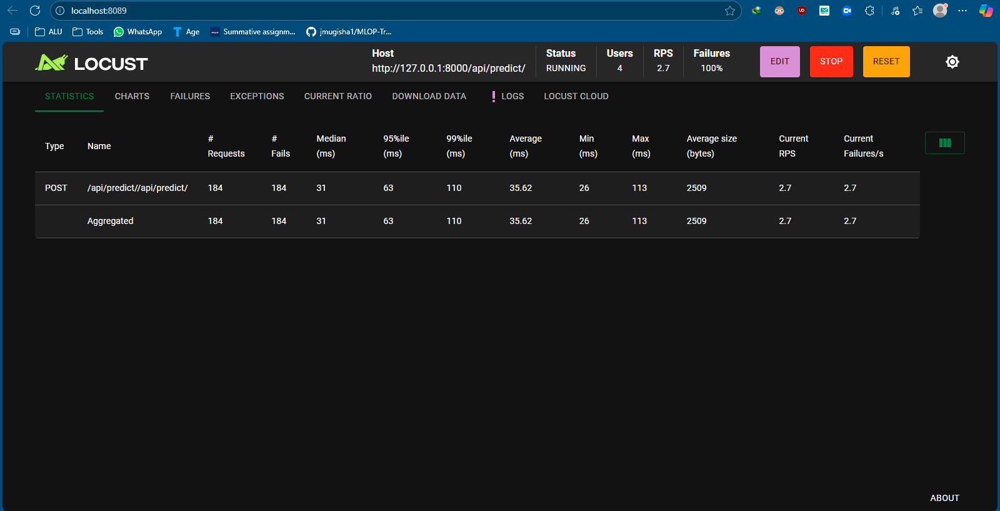

# MLOP-Traffic-Image-Classification

### project description

```bash
this a classification model on traffic vehicles (cars, motorcycles, trucks and bus)
making a classfication of images of the above classes
```

### initial dataset

https://www.kaggle.com/datasets/kaggleashwin/vehicle-type-recognition

# retraining data

https://www.kaggle.com/datasets/kunalmadan/vehicle-multi-classification?resource=download

# youtube link

https://www.youtube.com/watch?v=kgkN9RV7WrY

# setting up api

```bash
pip install -r requirements.txt
venv\Scripts\activate
python manage.py runserver
```

### setting up frontend

```bash
pnpm install
pnpm run dev
```

### setting up notebook

```bash
cd src
pip install -r requirements.txt
```

### frontend link
### note the model takes time to load and show results 
### please be patient 

https://mlops-ui.vercel.app/

### locust results

### 4 users

### locust results

**Load test summary (4 users):**

- Endpoint tested: `/api/predict/`
- Host: `http://127.0.0.1:8000`
- Number of users: 4
- Requests sent: 184
- Average response time: 35.62 ms
- Median response time: 31 ms
- 95th percentile: 63 ms
- 99th percentile: 110 ms
- Min/Max response time: 26 ms / 113 ms
- Requests per second (RPS): 2.7
- Average response size: 2509 bytes
- Failures: 100% (184/184 requests failed)

**Locust logs:**

```
[2025-08-03 06:52:18,758] INFO: Starting test, 4 users spawned
[2025-08-03 06:52:29,167] INFO: Ramping to 4 users at a rate of 4.00 per second
[2025-08-03 06:52:29,169] INFO: All users spawned: {"ModelUser": 4}
```

>


